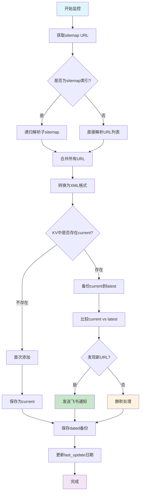
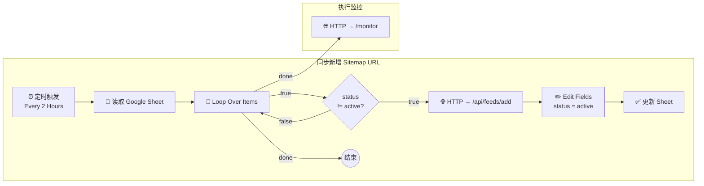

# Site Bot - 网站监控机器人

一个基于 Cloudflare Workers 的智能网站监控机器人，提供**双重监控**功能：
- 🗺️ **Sitemap监控**：自动检测网站sitemap变化，发现新发布内容
- 🔍 **Google收录监控**：基于Serper.dev API，监控过去24小时Google新收录页面

通过 飞书/Telegram/Discord/Gmail 多渠道推送更新通知，帮您全面掌握网站内容发布和收录状态。

## 🎯 项目特色

- **零成本部署**：基于 Cloudflare Workers，完全免费
- **双重监控**：Sitemap监控 + Google搜索收录监控，全面覆盖
- **智能监控**：自动检测 sitemap 变化，支持 .gz 压缩文件
- **Google收录监控**：基于Serper.dev API，监控过去24小时新收录页面
- **递归解析**：自动处理嵌套 sitemap 索引，获取所有实际内容 URL
- **静默模式**：只在有更新时发送通知，避免消息轰炸
- **多平台支持**：支持 Telegram、Discord、Gmail、飞书四种通知渠道
- **关键词汇总**：自动提取和分析新增内容关键词
- **实时交互**：支持命令行操作和状态查询
- **版本管理**：自动备份和版本控制，支持历史记录查询
- **可视化工作流**：内置 n8n 流程，图形化同步监控列表 & 执行监控

## 📊 n8n 集成概览


本项目开箱即用地提供了一套 n8n 工作流，帮助你可视化地完成两件事：

1. **同步监控列表**：
   - 定时读取 Google Sheet `sitemap-config`。
   - 发现 `status != active` 的行时自动调用 `/api/feeds/add`，完成一键接入。
   - 成功后把该行 `status` 更新为 `active`，防止重复添加。

2. **定时执行监控**：
   - 在同步流程结束后，立即触发 `/monitor`，推进后台比对 sitemap 并发送通知。


导入步骤：
```text
1. 打开 n8n → New Workflow → "Import from File"
2. 选择 n8n-sitemap-monitor-workflow.json
3. 按需修改 Google Sheet ID、Cloudflare Worker 域名
4. 点击 Activate，即可投入运行
```

工作流的详细节点和解释请参见下文《n8n 工作流示例》一节。

---

## 📋 第一部分：业务逻辑与功能

### 🔍 核心功能

#### 1. 双重监控系统

**🗺️ Sitemap 监控**：
- **定时检查**：每小时自动检查所有配置的 sitemap
- **变化检测**：对比新旧 sitemap，识别新增的 URL
- **智能解析**：支持 XML 和 HTML 格式的 sitemap
- **压缩支持**：自动处理 .gz 压缩的 sitemap 文件
- **递归解析**：自动处理嵌套 sitemap 索引，获取所有实际内容 URL

**🔍 Google 收录监控**：
- **实时检测**：基于 Serper.dev API，检测过去24小时Google新收录页面
- **site: 搜索**：使用 `site:域名` 操作符精准搜索
- **时间过滤**：支持 `tbs=qdr:d` 过滤过去24小时结果
- **智能去重**：只通知新发现的收录页面，避免重复
- **成本极低**：免费2500次查询，比SerpApi便宜50倍

#### 2. 消息推送策略

**静默模式设计**：
- ✅ **有更新**：发送完整的更新通知
- 🔇 **无更新**：完全静默，不发送任何消息
- 📊 **汇总报告**：所有更新完成后发送关键词汇总

**消息类型**：
1. **Sitemap更新通知**：包含域名、新增数量、sitemap 文件、URL 列表
2. **Google收录通知**：包含域名、新收录页面数量、标题、链接、摘要
3. **关键词汇总**：分析新增内容的主题关键词
4. **命令响应**：用户交互的反馈信息
5. **错误通知**：配置错误或网络问题的提示

#### 3. 支持的命令

**Telegram 命令**：
```
/start, /help     - 显示帮助信息
/rss list         - 显示所有监控的 sitemap
/rss add URL      - 添加 sitemap 监控
/rss del URL      - 删除 sitemap 监控
/news             - 手动触发关键词汇总
```

**Discord 命令**：
```
/rss list         - 显示所有监控的 sitemap
/rss add URL      - 添加 sitemap 监控
/rss del URL      - 删除 sitemap 监控
/news             - 手动触发关键词汇总
```

#### 4. API 接口

**健康检查**：
```
GET /health
```

**手动触发监控**：
```
POST /monitor
```

**API 状态查询**：
```
GET /api/status
```

**Sitemap 管理**：
```
POST /api/feeds/add     - 添加 sitemap 监控
POST /api/feeds/remove  - 删除 sitemap 监控
```

**Google 搜索监控**：
```
POST /api/google-search/add     - 添加 Google 搜索域名监控
POST /api/google-search/remove  - 删除 Google 搜索域名监控
POST /api/google-search/execute - 手动执行 Google 搜索监控
```

**通知测试**：
```
POST /test/notification - 发送测试通知
POST /test/simple      - 发送简单文本测试
```

**Webhook 端点**：
```
POST /webhook/telegram  - Telegram Webhook
POST /webhook/discord   - Discord Webhook
```

### 🏗️ 系统架构

#### 🔄 监控逻辑流程



#### 📊 KV 数据库字段说明

系统使用 Cloudflare KV 存储来管理监控数据，主要字段类型如下：

| 字段类型 | 示例 | 作用 | 数据格式 |
|---------|------|------|---------|
| **`rss_feeds`** | `rss_feeds` | 存储所有监控的sitemap URL列表 | `["https://site1.com/sitemap.xml", "https://site2.com/sitemap.xml"]` |
| **`last_update_域名`** | `last_update_blog.cloudflare.com` | 记录该网站最后更新日期 | `"20250704"` |
| **`sitemap_current_域名`** | `sitemap_current_blog.cloudflare.com` | **当前最新**的sitemap内容 | XML格式的URL列表 |
| **`sitemap_latest_域名`** | `sitemap_latest_blog.cloudflare.com` | **上一个版本**的sitemap内容 | XML格式的URL列表 |
| **`sitemap_dated_域名_日期`** | `sitemap_dated_pollo.ai_20250704` | **特定日期**的sitemap备份 | XML格式的URL列表 |

#### 🔄 数据版本管理机制

**第一天 (初次添加)**：
```
sitemap_current_blog.cloudflare.com = [URL1, URL2, URL3]
sitemap_dated_blog.cloudflare.com_20250704 = [URL1, URL2, URL3]
last_update_blog.cloudflare.com = 20250704
```

**第二天 (有新内容)**：
```
sitemap_latest_blog.cloudflare.com = [URL1, URL2, URL3]        # 昨天的备份
sitemap_current_blog.cloudflare.com = [URL1, URL2, URL3, URL4] # 今天新的
sitemap_dated_blog.cloudflare.com_20250705 = [URL1, URL2, URL3, URL4]

比较结果: 新增 [URL4] → 发送飞书通知 🔔
```

**第三天 (无变化)**：
```
sitemap_latest_blog.cloudflare.com = [URL1, URL2, URL3, URL4]  # 昨天的
sitemap_current_blog.cloudflare.com = [URL1, URL2, URL3, URL4] # 今天相同

比较结果: 无新增 → 静默处理 🔕
```

#### 🎯 核心检测逻辑

1. **静默模式**: 只在有**真正新内容**时才发送通知，避免噪音
2. **关键比较**: `current` vs `latest` = 找出新增的URL
3. **递归解析**: 自动处理嵌套sitemap索引，获取所有实际内容URL
4. **备份机制**: 每日自动备份，保留历史记录

### 🏗️ 系统架构图

```
┌─────────────────┐    ┌─────────────────┐    ┌─────────────────┐
│   Cloudflare    │    │   Telegram      │    │   Discord       │
│   Workers       │◄──►│   Bot API       │    │   Bot API       │
└─────────────────┘    └─────────────────┘    └─────────────────┘
         │
         ▼
┌─────────────────┐
│   Cloudflare    │
│   KV Storage    │
└─────────────────┘
```

**核心组件**：
- **RSSManager**：sitemap 下载、解析、存储管理
- **TelegramBot**：Telegram 消息发送和命令处理
- **DiscordBot**：Discord 消息发送和命令处理
- **Config**：环境变量配置管理

---

## 🚀 第二部分：快速上手指南

### 📋 前置要求

1. **Cloudflare 账户**
   - 注册 [Cloudflare](https://cloudflare.com) 账户
   - 验证邮箱地址

2. **Node.js 环境**
   - 安装 Node.js 16+ 版本
   - 安装 npm 或 yarn

3. **Bot Token**
   - Telegram Bot Token (从 @BotFather 获取)
   - Discord Bot Token (可选，从 Discord Developer Portal 获取)

### 🔧 快速部署

#### 步骤 1: 安装 Wrangler CLI

```bash
npm install -g wrangler
```

#### 步骤 2: 登录 Cloudflare

```bash
wrangler login
```

#### 步骤 3: 安装项目依赖

```bash
npm install
```

#### 步骤 4: 创建 KV 命名空间

```bash
# 创建 KV 命名空间
wrangler kv namespace create SITEMAP_STORAGE

# 创建预览环境的命名空间
wrangler kv namespace create SITEMAP_STORAGE --preview
```

#### 步骤 5: 更新配置文件

将得到的 ID 更新到 `wrangler.toml` 文件中：

```toml
[[kv_namespaces]]
binding = "SITEMAP_STORAGE"
id = "xxxxxxxxxxxxxxxxxxxxxxxxxxxxxxxx"  # 替换为实际的 ID
preview_id = "xxxxxxxxxxxxxxxxxxxxxxxxxxxxxxxx"  # 预览环境 ID
```

#### 步骤 6: 设置环境变量

```bash
# 设置 Telegram Bot Token
wrangler secret put TELEGRAM_BOT_TOKEN
# 输入你的 Telegram Bot Token

# 设置目标聊天 ID
wrangler secret put TELEGRAM_TARGET_CHAT
# 输入频道用户名（如 @mychannel）或用户 ID

# 设置 Discord Token (可选)
wrangler secret put DISCORD_TOKEN
# 输入你的 Discord Bot Token

# 设置飞书 Webhook (可选)
wrangler secret put FEISHU_WEBHOOK
# 输入你的飞书群组机器人 Webhook URL

# 设置 Gmail 配置 (可选)
wrangler secret put GMAIL_USER
wrangler secret put GMAIL_PASSWORD
wrangler secret put GMAIL_TO

# 设置 Serper.dev API Key (Google搜索监控，可选)
wrangler secret put SERPER_API_KEY
# 输入你的 Serper.dev API Key (免费2500次查询)
```

**获取 TELEGRAM_TARGET_CHAT 的方法**：

1. **频道用户名**：直接使用频道用户名，如 `@mychannel`
2. **用户 ID**：使用 @userinfobot 获取你的用户 ID
3. **频道 ID**：将机器人添加到频道，使用 @userinfobot 获取频道 ID

**获取各种Token和密钥的方法**：

**Telegram**：
1. 在 Telegram 中找到 @BotFather
2. 发送 `/newbot` 命令
3. 按提示设置机器人名称和用户名
4. 获得 Token，格式如：`123456789:ABCdefGHIjklMNOpqrsTUVwxyz`

**飞书 Webhook**：
1. 在飞书群组中点击设置 → 群机器人 → 添加机器人
2. 选择"自定义机器人"
3. 设置机器人名称和描述
4. 复制生成的 Webhook URL，格式类似：
   ```
   https://open.feishu.cn/open-apis/bot/v2/hook/xxxxxxxxxx
   ```
5. 如果启用了签名校验，还需要设置：
   ```bash
   wrangler secret put FEISHU_SECRET
   # 输入签名密钥
   ```

**Serper.dev API Key** (Google搜索监控)：
1. 访问 [Serper.dev](https://serper.dev)
2. 注册账户（**免费获得2500次查询额度**）
3. 在 Dashboard 中复制 API Key
4. 成本对比：
   - **Serper.dev**: $0.30/1000次（免费2500次）
   - SerpApi: $15/1000次（免费100次/月）
   - **节省成本50倍！**

#### 步骤 7: 配置 Webhook

**Telegram Webhook 设置**：

方法一：浏览器访问（推荐）
```
https://api.telegram.org/bot<YOUR_BOT_TOKEN>/setWebhook?url=https://site-bot.your-subdomain.workers.dev/webhook/telegram
```
将 `<YOUR_BOT_TOKEN>` 替换为你的实际 Bot Token，`your-subdomain` 替换为你的 Workers 子域名。

方法二：curl 命令
```bash
curl -X POST "https://api.telegram.org/bot<YOUR_BOT_TOKEN>/setWebhook" \
     -H "Content-Type: application/json" \
     -d '{"url": "https://site-bot.your-subdomain.workers.dev/webhook/telegram"}'
```

**Discord Webhook 设置**：
在 Discord Developer Portal 中设置交互端点：
```
https://site-bot.your-subdomain.workers.dev/webhook/discord
```

#### 步骤 8: 部署到 Cloudflare

```bash
# 开发环境测试
npm run dev

# 生产环境部署
npm run deploy
```

### 🔧 本地开发配置

#### 创建本地环境变量文件

在项目根目录创建 `.dev.vars` 文件（用于本地开发）：

```bash
# 创建 .dev.vars 文件
touch .dev.vars
```

编辑 `.dev.vars` 文件，添加以下内容：

```env
TELEGRAM_BOT_TOKEN=your_telegram_bot_token_here
TELEGRAM_TARGET_CHAT=@your_channel_or_user_id
DISCORD_TOKEN=your_discord_token_here
FEISHU_WEBHOOK=https://open.feishu.cn/open-apis/bot/v2/hook/xxxxxxxxxx
FEISHU_SECRET=your_feishu_secret_here
GMAIL_USER=your_gmail@gmail.com
GMAIL_PASSWORD=your_gmail_app_password
GMAIL_TO=recipient@example.com
```

**注意**：`.dev.vars` 文件已添加到 `.gitignore`，不会被提交到版本控制。

#### 本地开发测试

```bash
# 启动本地开发服务器
npm run dev

# 测试健康检查
curl http://localhost:8787/health

# 测试手动触发监控
curl -X POST http://localhost:8787/monitor
```

### 🔄 修改和更新

#### 修改业务逻辑

**添加新的消息类型**：
1. 编辑 `src/apps/telegram-bot.js` 或 `src/apps/discord-bot.js`
2. 添加新的消息发送函数
3. 在相应位置调用新函数

**修改监控策略**：
1. 编辑 `src/services/rss-manager.js`
2. 修改 `downloadSitemap` 函数的解析逻辑
3. 调整 `addFeed` 函数的处理流程

**添加新的命令**：
1. 在 `src/apps/telegram-bot.js` 的 `handleTelegramUpdate` 函数中添加新的 case
2. 实现对应的处理函数
3. 更新帮助信息

#### 更新部署

```bash
# 拉取最新代码
git pull

# 重新部署
npm run deploy
```

#### 环境变量更新

```bash
# 更新特定变量
wrangler secret put TELEGRAM_BOT_TOKEN

# 删除变量
wrangler secret delete TELEGRAM_BOT_TOKEN
```

### 📊 监控和调试

#### 🧪 监控功能测试

**🗺️ Sitemap 监控测试**

**1. 添加 sitemap 监控**：
```javascript
// 在浏览器控制台中运行
fetch('/api/feeds/add', {
  method: 'POST',
  headers: {'Content-Type': 'application/json'},
  body: JSON.stringify({
    url: 'https://blog.example.com/sitemap.xml'
  })
})
.then(res => res.json())
.then(data => {
  console.log('添加结果:', data);
  alert('Sitemap监控添加完成！');
});
```

**2. 手动触发 sitemap 监控**：
```javascript
// 立即执行一次 sitemap 监控检查
fetch('/monitor', {
  method: 'POST'
})
.then(res => res.json())
.then(data => {
  console.log('Sitemap监控结果:', data);
  alert('Sitemap监控完成！检查是否收到通知');
});
```

**🔍 Google 搜索监控测试**

**3. 添加 Google 搜索监控**：
```javascript
// 添加域名到 Google 搜索监控
fetch('/api/google-search/add', {
  method: 'POST',
  headers: {'Content-Type': 'application/json'},
  body: JSON.stringify({
    domain: 'example.com'  // 只需域名，不包含 https://
  })
})
.then(res => res.json())
.then(data => {
  console.log('Google搜索监控添加结果:', data);
  alert('Google搜索监控添加完成！');
});
```

**4. 手动触发 Google 搜索监控**：
```javascript
// 立即执行一次 Google 搜索监控
fetch('/api/google-search/execute', {
  method: 'POST'
})
.then(res => res.json())
.then(data => {
  console.log('Google搜索监控结果:', data);
  alert('Google搜索监控完成！检查是否收到新收录通知');
});
```

**5. 查看完整监控状态**：
```javascript
// 查看当前所有监控的网站和状态
fetch('/api/status')
.then(res => res.json())
.then(data => {
  console.log('当前监控状态:', data);
  console.log('Sitemap监控网站:', data.feeds);
  console.log('Google搜索监控域名:', data.google_search_domains);
  console.log('Google搜索状态:', data.google_search_status);
  console.log('启用的通知渠道:', data.enabled_channels);
});
```

**6. 删除监控（可选）**：
```javascript
// 删除 sitemap 监控
fetch('/api/feeds/remove', {
  method: 'POST',
  headers: {'Content-Type': 'application/json'},
  body: JSON.stringify({
    url: 'https://blog.example.com/sitemap.xml'
  })
})
.then(res => res.json())
.then(data => console.log('Sitemap删除结果:', data));

// 删除 Google 搜索监控
fetch('/api/google-search/remove', {
  method: 'POST',
  headers: {'Content-Type': 'application/json'},
  body: JSON.stringify({
    domain: 'example.com'
  })
})
.then(res => res.json())
.then(data => console.log('Google搜索监控删除结果:', data));
```

#### 🔍 KV 数据库监控

**访问 Cloudflare Dashboard**：
1. 登录 Cloudflare Dashboard
2. 进入 Workers → KV
3. 点击你的 `SITEMAP_STORAGE` 命名空间
4. 查看存储的数据结构

**关键数据项检查**：

**Sitemap 监控相关**：
- `rss_feeds`: 确认 sitemap 监控列表是否正确
- `sitemap_current_域名`: 检查最新内容是否为实际URL而非sitemap索引
- `last_update_域名`: 确认更新日期是否正确

**Google 搜索监控相关**：
- `google_search_domains`: 确认 Google 搜索监控的域名列表
- `google_search_域名`: 检查搜索历史记录
- `google_search_last_check_域名`: 确认最后检查时间

#### ⏰ 定时任务监控

**定时任务配置**：
- **Sitemap 监控**: 每小时自动执行一次 (`0 * * * *`)
- **Google 搜索监控**: 需要手动执行或在 n8n 中配置
- **下次执行**: 可在 Cloudflare Dashboard 的 Workers → Cron Triggers 中查看

**手动测试监控任务**：
```bash
# 查看实时日志
wrangler tail

# 手动触发 sitemap 监控
curl -X POST https://your-worker.workers.dev/monitor

# 手动触发 Google 搜索监控
curl -X POST https://your-worker.workers.dev/api/google-search/execute
```

#### 查看实时日志

```bash
wrangler tail
```

#### 健康检查

访问你的 Worker URL + `/health`：
```
https://site-bot.your-subdomain.workers.dev/health
```

#### API 状态

访问 `/api/status` 查看运行状态：
```
https://site-bot.your-subdomain.workers.dev/api/status
```

### 🔍 故障排除

#### 常见错误

1. **"Initialization Failed"**
   - 检查环境变量是否正确设置
   - 确认 KV 命名空间 ID 是否正确

2. **"配置验证失败"**
   - 确保至少配置了一个通知渠道（Telegram、Discord、飞书或Gmail）
   - 检查 Token 和 Webhook URL 格式是否正确

3. **"KV 存储错误"**
   - 确认 KV 命名空间已创建
   - 检查 `wrangler.toml` 中的 ID 是否正确

4. **"定时任务不执行"**
   - 检查 cron 表达式：`"0 * * * *"` (每小时执行)
   - 确认 Workers 已正确部署

5. **"飞书通知失败"**
   - 检查 Webhook URL 是否正确
   - 确认飞书机器人是否已添加到群组
   - 如果启用了签名校验，检查 `FEISHU_SECRET` 是否正确
   - 关闭签名校验可解决大部分问题

6. **"递归解析失败"**
   - 检查 sitemap URL 是否可访问
   - 确认网站的 robots.txt 允许访问 sitemap
   - 查看 Workers 日志了解具体错误信息

#### 调试步骤

1. **检查配置**
   ```bash
   wrangler whoami
   wrangler kv:namespace list
   ```

2. **本地测试**
   ```bash
   npm run dev
   ```

3. **查看日志**
   ```bash
   wrangler tail
   ```

4. **重新部署**
   ```bash
   wrangler deploy
   ```

### 💰 成本控制

#### 免费额度

- **Workers 请求**：100,000 次/天
- **KV 读取**：100,000 次/天
- **KV 写入**：1,000 次/天
- **CPU 时间**：10ms/请求

#### 使用量监控

在 Cloudflare Dashboard 中查看：
1. Workers > 你的 Worker > Analytics
2. Workers > KV > 你的命名空间 > Analytics

#### 优化建议

1. **减少请求频率**：已内置 2 秒延迟
2. **优化 sitemap 大小**：建议单个文件 < 1MB
3. **合理设置监控数量**：建议 < 50 个 sitemap

### 🎉 部署完成

恭喜！你的 Site Bot 已经成功部署到 Cloudflare Workers。

#### 下一步

1. **测试功能**：在 Telegram 中发送 `/start` 命令
2. **添加监控**：使用 `/rss add URL` 添加 sitemap
3. **查看状态**：访问 `/api/status` 查看运行状态
4. **监控日志**：使用 `wrangler tail` 查看实时日志

#### 支持

如果遇到问题，请：
1. 查看本文档的故障排除部分
2. 检查 Cloudflare Workers 日志
3. 提交 Issue 到项目仓库 

## 🔄 n8n 工作流示例：自动同步 + 执行监控

下面这张 Mer-maid 流程图展示了当前在 n8n 中实现的两条定时工作流：



**流程说明**

1. **同步新增 Sitemap URL（紫色部分）**
   1. 每 2 小时触发一次。
   2. 读取 Google Sheet `sitemap-config`，逐行检查 `status` 字段。
   3. 若发现行的 `status ≠ active`，调用 Cloudflare Worker `/api/feeds/add` 添加监控。
   4. 添加成功后，将该行的 `status` 更新为 `active`，避免下次重复添加。

2. **执行监控（黄色部分）**
   * 当整张表循环结束后（`Loop Over Items` 的 **done** 输出），立即调用 `/monitor` 端点，触发后台比对 sitemap。

> 这样设计可以保证：
> * **监控列表** 与 Google&nbsp;Sheet 保持同步。
> * 只有完成列表同步后才执行一次完整的 sitemap 监控，避免重复调用。

如需进一步在 `/monitor` 之后接入 AI 过滤、飞书推送等，只需在图中的 **B1** 节点后串联相应节点即可。

## 🔍 Google 搜索收录监控功能 🆕

### 🎯 功能亮点

本项目除了传统的 Sitemap 监控外，还新增了 **Google 搜索收录监控**功能，为您提供双重保障：

| 监控类型 | 监控内容 | 触发条件 | 适用场景 |
|---------|----------|----------|----------|
| 🗺️ **Sitemap 监控** | 网站 sitemap 文件变化 | 网站发布新内容 | 第一时间发现内容发布 |
| 🔍 **Google 收录监控** | Google 搜索结果 | Google 收录新页面 | 确认内容被搜索引擎收录 |

### 💰 成本优势

我们选择了性价比最高的 **Serper.dev API**：

| 对比项 | Serper.dev | SerpApi | 优势 |
|--------|------------|---------|------|
| 🆓 **免费额度** | **2500次查询** | 100次/月 | **25倍更多** |
| 💵 **付费价格** | **$0.30/1000次** | $15/1000次 | **便宜50倍** |
| ⚡ **响应速度** | 1-2秒 | 1-3秒 | 相当 |
| 🎯 **功能支持** | 完整 | 完整 | 相同 |

### 🚀 快速配置

**第一步：获取免费 API 密钥**
```bash
# 1. 访问 https://serper.dev 注册（无需信用卡）
# 2. 获得免费 2500 次查询额度
# 3. 复制 API Key 并设置：
wrangler secret put SERPER_API_KEY
```

**第二步：添加监控域名**
```bash
curl -X POST "https://your-worker.workers.dev/api/google-search/add" \
  -H "Content-Type: application/json" \
  -d '{"domain": "your-domain.com"}'
```

**第三步：执行监控测试**
```bash
curl -X POST "https://your-worker.workers.dev/api/google-search/execute"
```

### 📱 通知效果预览

当发现新的 Google 收录页面时，您会收到这样的通知：

```
🔍 Google 搜索监控更新

域名: pollo.ai
新收录页面: 3 个
检查时间: 2025-01-06 18:30:00

新收录的页面:
1. [AI Kitty Plane Video Generator](https://pollo.ai/ai-kitty-plane)
   Just upload an image of any cat and it can create a video...

2. [40+ AI-effecten voor video's](https://pollo.ai/video-effects)
   Ontdek meer dan 40 gratis AI-video-effecten...

3. [probeer de naadloze textuurgenerator gratis](https://pollo.ai/ai-image-generator)
   Onze naadloze textuurgenerator creërt textuurafbeeldingen...
```

### 🔧 独立监控设计

- **✅ 完全独立**：Google 搜索监控与 Sitemap 监控互不干扰
- **✅ n8n 兼容**：现有工作流无需任何修改
- **✅ 按需启用**：不想用就不配置，不影响现有功能
- **✅ 灵活控制**：可单独管理监控域名和执行时机

### 📚 完整文档

详细配置指南：[**GOOGLE_SEARCH_SETUP.md**](./GOOGLE_SEARCH_SETUP.md)

包含完整的：
- 🔧 配置步骤指南
- 📋 API 接口文档  
- 🧪 测试验证方法
- 🔍 故障排除指南
- 💡 最佳实践建议

---

## 🎉 双重监控，全面覆盖

**🚀 现在您拥有了业界最完整的网站监控解决方案：**

1. **📝 内容发布监控** - Sitemap 变化 → 第一时间发现新内容
2. **🔍 收录状态监控** - Google 搜索结果 → 确认搜索引擎收录情况  
3. **💰 成本极低** - 免费额度 + 超低价格 → 长期可持续使用
4. **🔔 多渠道通知** - 飞书/Telegram/Discord/Gmail → 不错过任何更新

**从内容发布到搜索收录，一站式监控，让您的网站运营更加高效！** 